# IM Ops — Architecture Diagrams

Mermaid-compatible. Render in GitHub, VS Code (Mermaid Preview), or any compatible viewer.

---

## 4. Middleware & Auth Flow

### Request gate (every HTTP request)

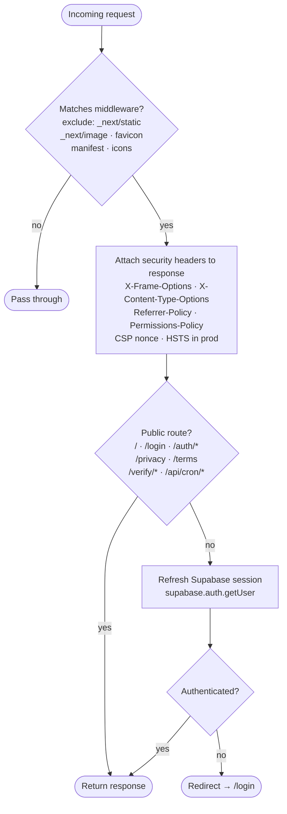

> `/api/cron/*` is exempt from the session gate — Vercel Cron has no user session. The route handler enforces its own `CRON_SECRET` bearer check instead.
> CSP uses `'unsafe-inline' + 'unsafe-eval'` in development (for React Fast Refresh) and a nonce-based `'strict-dynamic'` policy in production. `'wasm-unsafe-eval'` is always included for `@react-pdf/renderer`.

---

### Google OAuth login sequence

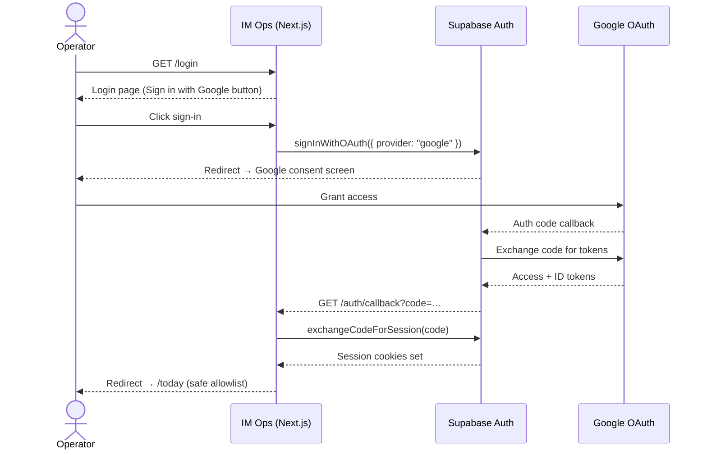

> The redirect target on callback is validated against a 14-route allowlist in `/auth/callback/route.ts`. Unknown targets fall back to `/today`.

---

## 5. Expense Lock Decision Tree

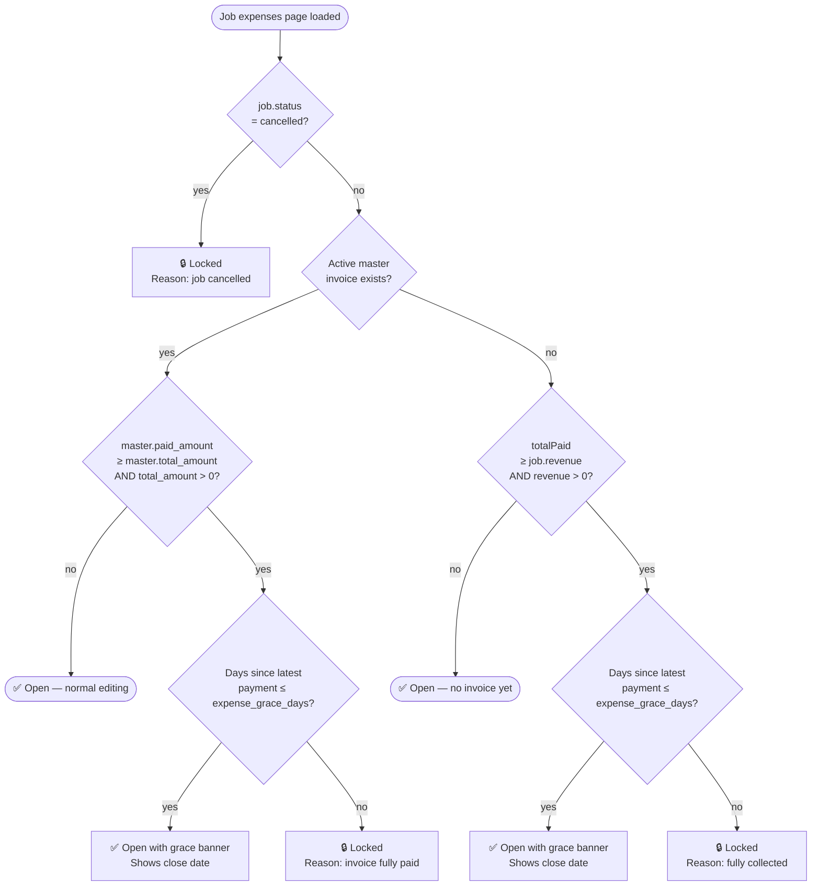

> **Two enforcement points must stay in sync:**
> 1. UI — `expenses/page.tsx` derives `lockReason` / `graceEndsAt` and passes to `ExpensePanel`, which hides the form and guards its mutation handlers
> 2. DB — `before_expense_lock_check` trigger → `is_job_expenses_locked()` function (migration `009`) blocks INSERT/UPDATE/DELETE even for direct PostgREST writes
>
> `expense_grace_days` comes from `system_settings` (default 7). Payment dates are converted to Jakarta timezone before comparison.

---

## 6. Data-Fetch Architecture (RSC Pattern)

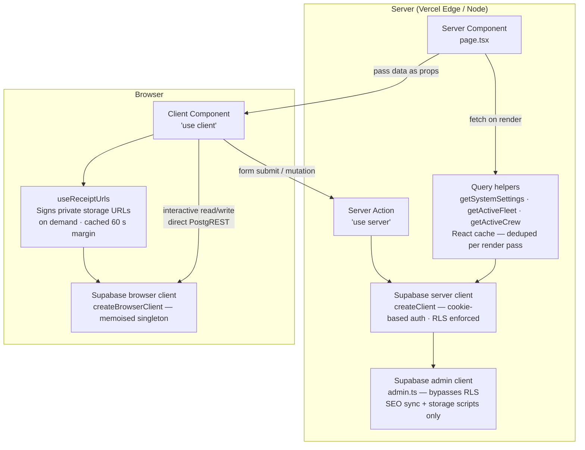

**Rules:**
- Data fetches default to Server Components — never fetch in a client component unless the data is interactive (e.g., live mutation feedback)
- `getSystemSettings()` / `getActiveFleet()` / `getActiveCrew()` in `src/lib/supabase/queries.ts` wrap with `React.cache()` so multiple Server Components on the same page share one query
- Server Actions (`src/app/actions/`) handle form submissions and server-only work (PDF asset resolution, map URL resolution, locale switching)
- Client-side direct PostgREST is used for expense entry and other write paths that don't need Server Action overhead — the DB trigger is the safety net
- Private bucket reads (receipts) are signed on-demand via `useReceiptUrls` + `batchSignedUrls`; public bucket reads (proposals, invoices) use plain public URLs

---

## 7. Proposal PDF & eSign Verification Flow

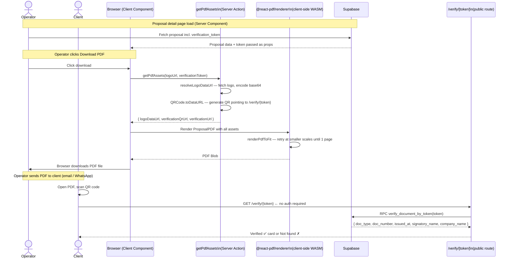

> **Key points:**
> - PDF generation is entirely client-side (WASM via `@react-pdf/renderer`); this is why `'wasm-unsafe-eval'` is in the CSP
> - The QR code is generated server-side in the Server Action so the `qrcode` library doesn't ship to the browser bundle
> - `verification_token` is a pre-generated UUID stored on the proposal record; it never expires
> - `/verify/[token]` is a public route (no auth) — it's in the middleware allowlist
> - The same eSign pattern applies to invoices and payment receipts (each has its own `verification_token`)

## 1. Entity Lifecycle

### Pipeline

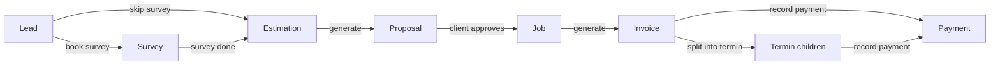

---

### Lead status machine

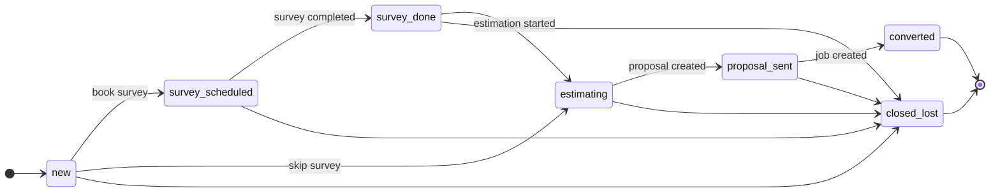

> `converted` ⟺ a job exists. `proposal_sent` ⟺ at least one non-terminal proposal. Both are kept in sync by app logic — not triggers.

---

### Proposal status machine

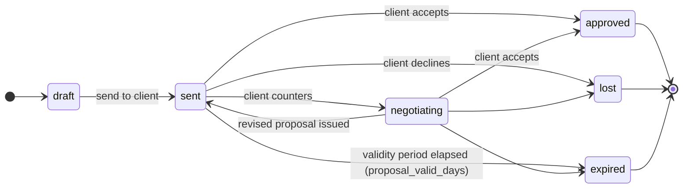

> Once `approved`: `final_price`, `proposal_number`, and the estimation snapshot are **immutable**.

---

### Invoice status machine

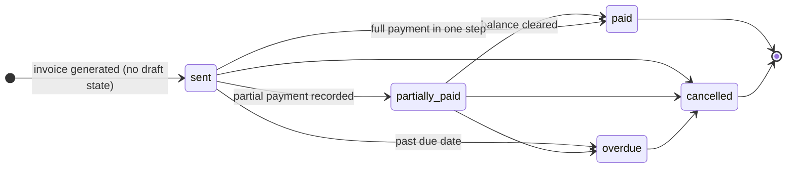

> Status is auto-advanced by the `update_invoice_status` trigger when payments are recorded. On a child invoice the trigger also rolls up `paid_amount` and status to the master.

---

### Job status (derived — not stored)

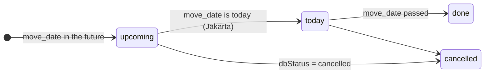

> `deriveJobStatus(moveDate, dbStatus)` computes this on every read. There is no `status` column on `jobs`.

---

## 2. Invoice & Payment Model

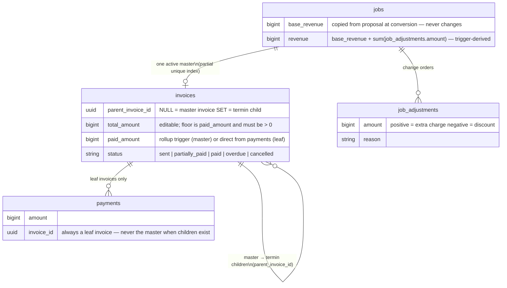

**Key rules:**
- One active master per job enforced by: `UNIQUE (job_id) WHERE parent_invoice_id IS NULL AND status <> 'cancelled'`
- Payments always attach to **leaf** invoices (termin children if any exist, else the master itself)
- Master `paid_amount` is trigger-rolled-up from children — never written directly
- Editing `total_amount` re-runs `recompute_invoice_paid` and re-derives status (migration `012`)
- AR views and RPCs use leaf-only filters to avoid double-counting master + children

---

## 3. System Context (C4 Level 1)

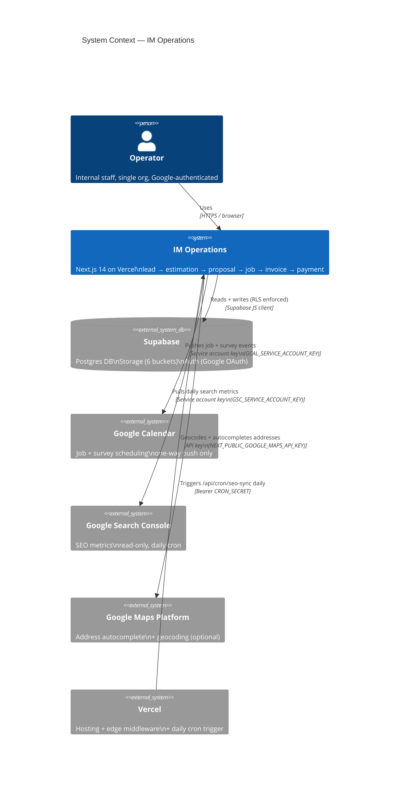

**Auth detail:** Google OAuth is brokered by Supabase Auth — the app never calls Google OAuth directly. Middleware gates every route except `/login`, `/auth`, `/privacy`, `/terms`, `/verify`. `/verify/[token]` is a public eSign verification route.
